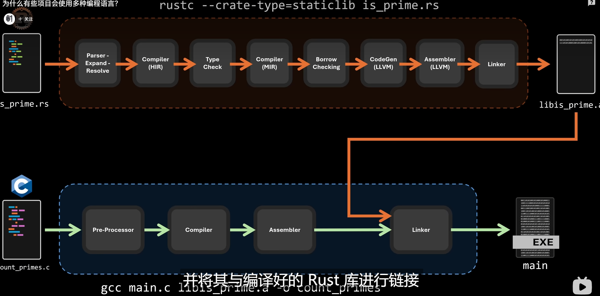

动态链接库中不包含启动执行的入口点，因为动态库并没有主函数

而主函数是用来启动程序的 ，当程序采用动态链接方式编译的时候，链接器并不会将库函数直接复制到可执行文件中。而是仅仅插入一个指向该库中引用的函数的机器指令

运行时，如果程序需要调用该动态库的函数 操作系统将会载入所需函数的地址空间到内存，。

有的时候在需要极致性能的时候甚至需要手搓汇编。然后和Cpp语言一起交给GCC编译之后生成可执行文件、。

所以说Gcc是工具链，所有步骤都是可以热拔插的，然后替代工具链的某些部分

但是并不是所有人都要写汇编语言的，比如使用fortran,他有一套自己的编译套件，所以在最后生成链接库之后能够和C汇编后的代码结合使用，他们能够识别不同的语言的链接库

如果在C中调用rust的函数，只需要rust链接器生成的文件和c汇编之后的文件一起在C的链接器中处理之后就能产出可执行文件，反之，rust中调用c的语言也是如此。

但是需要注意的是，很多时候编译的代码对寄存器存储数据或者返回的位置不同，所以在二者代码在最后通过链接器处理之后还是会出现很多报错，比如语言A的a+b是存入寄存器0和1,而B语言的a+b是存入寄存器1和2.

#### ABI

这些底层定义使用过Application binary Interface （ABI)接口定义的。如同API在应用层定义函数、所以在使用两种共不同编译语言时候，仅让两着生成目标文件是不够的，其中一种语言与其交互的代码部分必须符合对方ABI的预期