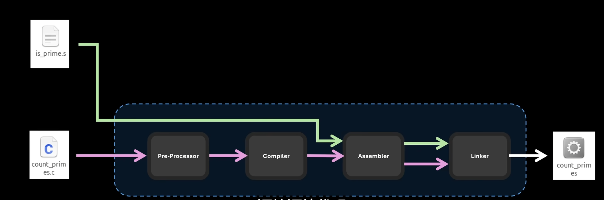
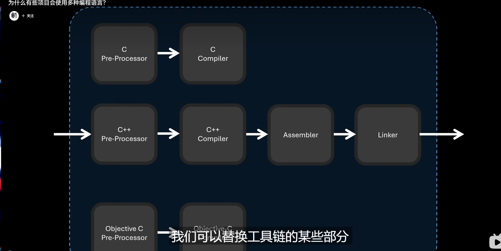
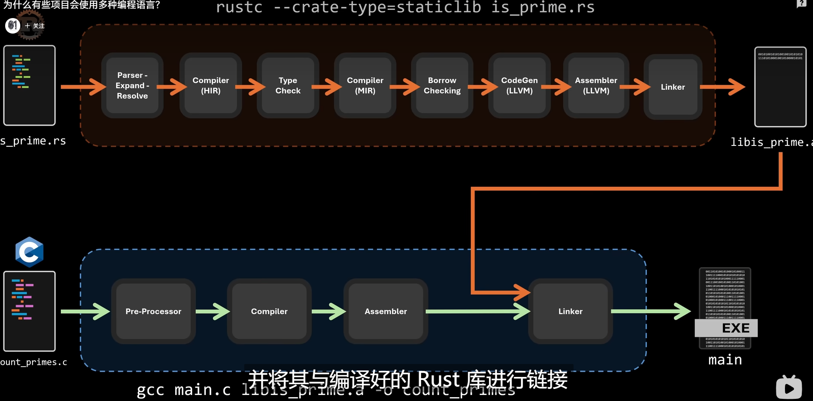

动态链接库中不包含启动执行的入口点，因为动态库并没有主函数

而主函数是用来启动程序的 ，当程序采用动态链接方式编译的时候，链接器并不会将库函数直接复制到可执行文件中。而是仅仅插入一个指向该库中引用的函数的机器指令

运行时，如果程序需要调用该动态库的函数 操作系统将会载入所需函数的地址空间到内存，。

有的时候在需要极致性能的时候甚至需要手搓汇编。然后和Cpp语言一起交给GCC编译之后生成可执行文件、。




所以说Gcc是工具链，所有步骤都是可以热拔插的，然后替代工具链的某些部分


但是并不是所有人都要写汇编语言的，比如使用fortran,他有一套自己的编译套件，所以在最后生成链接库之后能够和C汇编后的代码结合使用，他们能够识别不同的语言的链接库



如果在C中调用rust的函数，只需要rust链接器生成的文件和c汇编之后的文件一起在C的链接器中处理之后就能产出可执行文件，反之，rust中调用c的语言也是如此。

但是需要注意的是，很多时候编译的代码对寄存器存储数据或者返回的位置不同，所以在二者代码在最后通过链接器处理之后还是会出现很多报错，比如语言A的a+b是存入寄存器0和1,而B语言的a+b是存入寄存器1和2.

#### ABI

这些底层定义使用过Application binary Interface （ABI)接口定义的。如同API在应用层定义函数、所以在使用两种共不同编译语言时候，仅让两着生成目标文件是不够的，其中一种语言与其交互的代码部分必须符合对方ABI的预期


# UECpp


### Cpp的前向声明

#### 问题：

在使用某些类之前需要声明类，为什么要声明？如果include的文件中有的话还要声明嘛？

#### 解答1：

如果在代码中用到一个指针或者引用，或者是参数列表返回值的时候用到的类名，而不需要知道类的内部细节，只需要声明一下即可，这种叫**前向声明**。

前向声明好处：

- 减少编译依赖：不用引入.h，减少文件间的耦合‘
- 加快编译速度：对UE这种大型文件来说，少一次include，少很多编译量
- 避免循环依赖：目前见的比较少，靠前向声明就能打破include循环。

#### 解答2：

如果类中有include了不需要前向声明了。因为#include操作会直接把内容复制到当前文件，编译器自然知道类的定义

但是注意一种情况，在`Cpp`中引入`MyClass.h`的时候，如果又在.h中使用了指针`MyClass*`或者`MyClass&`则最好用前向声明，避免头文件膨胀。

#### 问题：

那为什么我声明了对应的类我通过ctrl进行跳转发现跳转不到，这个类的声明还有作用吗？如果是我想获取蓝图对象类型的时候怎么声明？

​	❓为什么跳转不到 

#### 解答:

因为前向声明仅仅是告诉编译器有这个类存在，其不包含类成员、方法等任何实现细节。IDE在跳转的时候需要知道类的完整定义所在位置，而前向声明本身就没有位置可跳，所以ctrl没反应。

所以前向声明在这里是作用是什么？解决编译依赖问题，但是其不提供编辑器跳转功能，如要跳转必须#include完整头文件。

#### 问题：

在C++中获取蓝图对象类型时候怎么声明？

⚠注意，蓝图类是基于某个C++类的，所以你在C++中声明或者Include的时候必须是它的父类，不可能直接前向声明一个`_C`结尾的蓝图类。因为**`_C`类是编译蓝图生成的**，不在源码里。 【这里注意蓝图类和蓝图定义的区别】

在这个前提下分为两种情况：

​	只存指针或引用，不访问成员对象的时候：

​		结合上面讲的就是使用蓝图类父类（C++类）的前向声明。

​	需要访问类中成员或者调用方法的时候：

​		就必须include对应的蓝图类父类的（C++类）文件了

##  **重点总结**

- 前向声明作用：减少依赖、加快编译、避免循环引用，但不能跳转。
- 要能跳转和访问类成员，必须 `#include` 完整定义。
- `UE` 蓝图类在 C++ 中操作时，其实是操作其 C++ 父类（`TSubclassOf` 或 指针/引用）。
- `_C` 后缀的蓝图运行时类无法直接前向声明，因为它不在源码中。


#### 问题：

嘶~那C++中能访问蓝图中的函数嘛？怎么访问？

#### 解答：

我想到情况是，函数纯在**蓝图**中实现的，并没有在C++中使用`BlueprintImplementtableEvent`这种情况,我是在lua中遇到过的，在C++中也可以这样处理，也就是在C++中获取**蓝图类**并调用 （分清蓝图和蓝图类）：

```c++
假如编辑器中有一个蓝图BP_MyActor继承自MyActor
//获取蓝图类（路径为蓝图资产路径）
UClass *BPClass = LoadClass<AMyActor>(nullptr,TEXT("/Game/BPMyActor.BP_MyActor_C"));
AMyActor* SpawnedActor = GetWorld()->SpawnActor<AMyActor>(BPClass);
SpawnedActor->MyBlueprintFunction(); // 直接调用蓝图实现
```


如果不是调用纯蓝图中的函数的话，也是有其他情况的：

1. 在`Cpp`声明了`BlueprintImplementableEvent`的时候

   ​	这种是只在蓝图实现，在其他地方C++可以直接调用

2. 还有一种是声明了`BlueprintCallable`的，可以在蓝图中实现，也可以在C++中实现，如果函数在蓝图中被重写逻辑，那么C++调用此函数的时候直接执行蓝图逻辑。

以上就是问题的答案以及相关的拓展。

