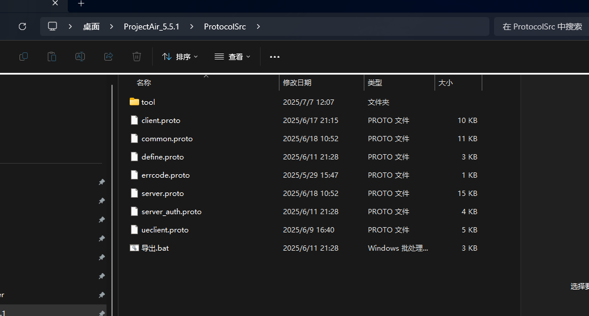

# 了解摆放物品相关的流程

- 通常情况下思路应该是playercontroller进行控制，从背包拿出来东西之后，然后有管理器进行监测是否可以放置，判断放置条件，整个过程中应该多次向服务器发送验证请求比如背包中有物品，是否能够放置，放置时候生成应该从server背包中减少一个该物品数量

  

相关文件：

BP_ProjectAirPlayerController.lua

ItemStorageComponent.lua

settleGamePlaymanager.lua

以及UI显示相关的UISubSystem


打开背包->选择item ->显示item confirm UI ->UI点击事件中使用g_SettleGameplayManager:ReqCreateItemModel() 这个点击的前提正常的拜摆放位置，然后就是执行了


目前没找到的是在哪里判断摆放位置是否合理的

- tempmodel 的摆放规则，zaiDT_Item表中能够找到，settleType 12345等每个摆放规则不一样，但是具体摆放的判断函数不知道在哪，应该是在CPP中

  - ```lua
    M.SettleTypeMap[g_SettleType.SquareFloorPlacement] = require("SettleGameplay.SquareFloorPlacement"):New()
    M.SettleTypeMap[g_SettleType.SideEdgePlacement] = require("SettleGameplay.SideEdgePlacement"):New()
    ```

- 在摆放的时候，是有一个预览的，预览模型也是controller进行Spawn的

  - ```lua
    ItemTempModel
    ```

- 在加载完成相关配置之后就开始  `self.ItemTempModel:StartMove`这是生成的临时模型中的函数

- 然后调用了startmove函数，可以看到，startmove中对生成物品进行的initDisplay处理，也就是材质颜色做了处理，所以在放置的时候我们能够看到红色或绿色 【怪不得找不到设置临时模型材质的地方，原来是在startmove中调用了】

- 然后在移动时摆放物品的相关逻辑就在startmove函数中看就行。应该是确定位置之后，点击UI上的放置按钮就会执行生成对应真正模型的逻辑，总之settleGamePlaymanager.CreateItemTempModel相关函数基本在这里就结束了。

- 对的，在确认摆放的`Onclick`的地方判断`g_SettleGameplayManager:ReqCreateItemModel() ` true的话就隐藏摆放的`UI`了 。

- 在摆放位置不合理的时候是有报错的`pushEvent`找不到在哪里创建的`AddEventListener`，然后找到了`WBP_Warning.lua`文件注册了警告相关的监听器


从bag中选择物品之后【`WBP_bag.lua`中的`ButtonConfirm_OnClicked`】

- 其中函数调用是` Owner.ItemStorageComponent:ClientStartOperateItem(self.SelectedItemObject.ItemBase.Kid,self.CurrentOpt) `也就是客户端开始操作item

进入`ItemStorageComponent`查看函数

- ` ClientStartOperateItem`创建一个操作相关结构体，其中包含回调函数，判断是不是需要附着点的物品
  - 如果是的话，开启`StartPlaceInteraction`函数
  - 如果不是，发送错误信息
- 然后`self:OperateItem(opt)`,这里是`CPP`函数，此函数主要作用是进行和server交互
  - 然后我们开始看需要附着点的调用的函数`StartPlaceInteraction`
  - 此函数调用`SettleGameplayManager`中的`StartSettleDisplay`函数，由此将操作交接到此管理器中
- `SettleGameplayManager`中就是产生一个`tempmodel`放置预览相关的了。
  - 产生摆放预览的模型ItemTempModel，然后再加载相关的交互物信息，从表中寻找dataqeeee
- 放置预览又和UI一些相关，UI选择是否开启吸附【CheckBox_FitMode】,还有显示的是否选择该位置安放的按钮【Button_Confirm】以及取消安放的按钮【Button_Cancel】旋转或者镜像相关的几个按钮【Button_Left】
  - 确认安放的按钮是调用的ReqCreateItemModel函数，就是申请/确认相关的函数。


在我从背包掏出来甲板的时候打印了`UseItem_Interaction_Check` 但是并未找到有调用相关函数的，然后我通过全局搜索找到了是

- `itemStoreageComponent:UseItem_Interaction_Check`函数打印的。。然后这个过程基本就是在上述的ClientStartOperateItem中的函数 self:OperateItem(opt)执行之后，到C++中一看，客户端服务端都执行相关逻辑了.而服务端

  - 为了找到打印到log中的那行代码是怎么调用的，可以捋捋思路主要的逻辑还是在`itemStorageComponent`中，只要找到服务端的函数调用顺序即可。

  - 还有**难点**是`itemStorageComponent.lua`中几个函数没看明白，尤其是以下这段代码好像在其他代码中被返回了其中的数据，然后执行了同名的代码

  - ```lua
    local validItemOptType = 
    {
    --。。。
        [g_ItemOptType.ItemOptType_Place] = {
            [UE.EItemType.Interaction] = { check = "UseItem_Interaction_Check", opt  = "UseItem_Interaction" } ,
        },
    }
    ```

  - ```C++
    UItemStorageComponent::OperateItem函数，其中etNetMode() == NM_Client为true或者false进行分支，如果是客户端分为调试和正常联网模式，如果为false则是服务器处理逻辑
       //所以刚开始我以为当执行到operateItem函数的时候，二者基本是同时执行的，但是不是的，我能理解客户端执行的时候走netNetMode() == NM_Client分支，但是什么时候走netNetMode() != NM_Client的分支呢？服务端开发的时候？
    ```

  -    服务端分支触发场景 ： 
        1.响应客户端发送的RPC请求（最核心场景）
        客户端通过RPC向服务器发送请求后，服务端进程会接受并处理，此时会调用OperateItem并执行服务端分支。【？不知道为啥服务端会调用】


总结一下：RPC 是怎么做到让服务端执行函数的？

| 步骤       | 描述                                                     |
| ---------- | -------------------------------------------------------- |
| 客户端执行 | 调用 `OperateItem`，构造协议请求消息                     |
| 发送 RPC   | 使用封装的 `SendRPC`，将请求消息和两个回调函数发给服务端 |
| 服务端收到 | 根据消息 ID 查找处理函数                                 |
| 服务端处理 | 在处理函数中调用自己的 `OperateItem` 或相关逻辑          |
| 服务端响应 | 发送 `ClientGameItemOptResp`                             |
| 客户端收到 | 触发对应的回调函数，通知操作成功或失败                   |

> 虚幻引擎中被标记为BlueprintImplementableEvent的函数属于特殊函数，仅在C++中声明，具体实现在蓝图或者lua中实现。


### 重点处理：

#### protocol生成相关的逻辑我们不用看

比如

```c++
server.pb.h相关代码
class ServerDSOptItemResp final :
    public ::PROTOBUF_NAMESPACE_ID::Message /* @@protoc_insertion_point(class_definition:protocol.ServerDSOptItemResp) */ {
 public:
  inline ServerDSOptItemResp() : ServerDSOptItemResp(nullptr) {}
  ~ServerDSOptItemResp() override;
  explicit constexpr ServerDSOptItemResp(::PROTOBUF_NAMESPACE_ID::internal::ConstantInitialized);

  ServerDSOptItemResp(const ServerDSOptItemResp& from);
//...
    
```

- 很奇怪的代码，因为是机器生成的，所以不用关心具体逻辑。:accept:只需要知道这是一个**消息盒子**，相当于C++的结构体。用来不同系统间的序列化和反序列化。
- 所以我的问题是，protocol::xxx怎么来的:confused:?答：它们来自 `.proto` 文件， `.proto` 文件经过 `protoc` 编译器（`Google Protobuf`）编译后，会生成对应的 `.pb.h` 和 `.pb.cc` 文件，也就是你看到的 `ServerDSOptItemResp` 类。

- ##### 那为什么这些东西着么复杂❓

  - `Protobuf`需要支持跨平台序列化，反序列化缓存等高级功能
  - 但是我们不需要关心其内部实现，只当他是个高级结构体

- ##### 那我应该怎么用这些东西❓

  - 😶‍🌫️其实需要做的就两个事情

  - 构造请求

    - ```c++
      protocol::ServerDSOptItemReq msg;
      msg.set_XXX(..)//设置参数
      sendRPC(...,msg,...)
      ```

      

  - 读取响应

    - ```c++
      [&](const protocol::ServerDSOpItemResp& resp){
      	int code = resp.errcode();
      }
      這個对应源码就是匿名回调函数中调用的ItemCallback函数
      ```

      

### ✔ 建议你聚焦这些知识点：

| 知识点                    | 说明                        | 你需要掌握的程度               |
| ------------------------- | --------------------------- | ------------------------------ |
| `SendRPC`                 | 用于发起 RPC 请求，注册回调 | 明白它怎么调用，用来干嘛       |
| `protocol::XXXReq / Resp` | 自动生成的请求和响应结构    | 只要知道怎么设置字段和获取字段 |
| `.proto` 文件             | 定义消息结构的源头          | 不需要写，看看结构就行         |
| 回调函数机制              | 收到响应后执行某段逻辑      | 理解用法即可，别关心内部实现   |



:fire:差不多了，知道这个proto是啥就清楚很多了，然后看客户端回调函数那里也是对相关结构体中信息的解读

-----


### C++ server端 `FItemOperateCallBack CallBack·`

然后看看C++ server端返回的数据触发`FItemOperateCallBack CallBack·`绑定的回调函数，而回调函数创建是在`lua`中创建的。却能够绑定到C++ 中

#### 为什么？

- 这是delegate宏中的方法做的ExecuteIfBound

- 此时lua中的函数：

  - ```lua
    function M:ClientStartOperateItem(itemKid,optType,count,targetID)
        print("-------ClientStartOperateItem",itemKid,optType)
        local opt = UE.FOperateItemParams()
        opt.ItemKid = itemKid
        opt.OptType = optType
        opt.Count = count or 1
        opt.TargetID = targetID or 0
        opt.ValidObject = self
        local kid,component = itemKid,self
        opt.CallBack = function(_,isOK,err)
            if err == g_ErrCode.ErrCode_ItemNeedHitActor then
                component:StartPlaceInteraction(kid)
            elseif err~= g_ErrCode.ErrCode_OK then
                g_MsgEvent:PushEvent(nil,g_EventID.Event_ShowError,err)
            end            
        end
        self:OperateItem(opt)
    end
    ```

    可以看到创建了设置了匿名回调函数，但是unlua把 Lua 函数 **自动封装成了一个可以绑定给 `FItemOperateCallBack` 的代理函数对象**

    C++中

    ```c++
    pServerNet->SendRPC<protocol::ClientGameItemOptResp>(protocol::MsgID_ClientGameItemOptReq,msg,[WeakThis,itemParams](const protocol::ClientGameItemOptResp& resp)
    { //resp响应
    	itemParams.ItemCallBack(resp.errcode());	
    },
    ```

    .h文件中

    ```c++
    	//回调方法
    	UPROPERTY(BlueprintReadWrite, EditAnywhere)
    	FItemOperateCallBack CallBack;
    	void ItemCallBack(int32 errorCode) const
    	{
    		if ( nullptr == ValidObject || ValidObject.IsValid())
    			CallBack.ExecuteIfBound(errorCode == 0, errorCode);
    	}
    ```

#### 整体流程：

:white_check_mark::客户端Lua发起调用之前通过`FOperateItemParam`【操作道具的结构】将Lua回调函数绑定到C++中`FItemOperateCallBack`委托上 ,看好了这是谁的回调函数

:white_check_mark::然后lua中的回调函数**通过委托自带的函数`CallBack.ExecuteIfBound`绑定**到了C++中`FOperateItemParam`中的委托`FItemOperateCallBack CallBack`上

👉: 客户端发送 RPC 到服务器，并注册了一个 **Lambda 回调函数**，该回调中会调用 `itemParams.ItemCallBack(resp.errcode());`

:white_check_mark::然后服务器处理请求，处理完之后返回响应

触发C++的lambda函数  -- >触发`FOperateItemParam`上的回调函数【就是lua上绑的那个】

👉 `CallBack` 实际上就是在 Lua 中绑定的那个 `function(_, isOK, err)`，现在通过委托触发，传入两个参数：

- `errorCode == 0` → `isOK`

- `errorCode` → `err`

  

##### 委托中的`ExecuteIfBound`内联函数是干什么的❓

- `ExecuteIfBound()` 是 Unreal Engine 中动态委托（`DECLARE_DYNAMIC_DELEGATE` 或 `DECLARE_DYNAMIC_DELEGATE_TwoParams` 等）提供的一个**安全调用方法**。
- 一句话：  **如果这个委托有绑定函数（即不为空），就执行它；否则什么都不做。**

#### 总结：

:sunny:: Lua 把函数塞进了 C++ 委托，客户端发 RPC，服务器响应后，客户端 Lambda 回调触发 `ItemCallBack()`，最终通过委托执行 Lua 里的函数——全链路打通，事件完成闭环。


### 待解决：全局怎么开来两个线程呢？两个player在一张地图中

