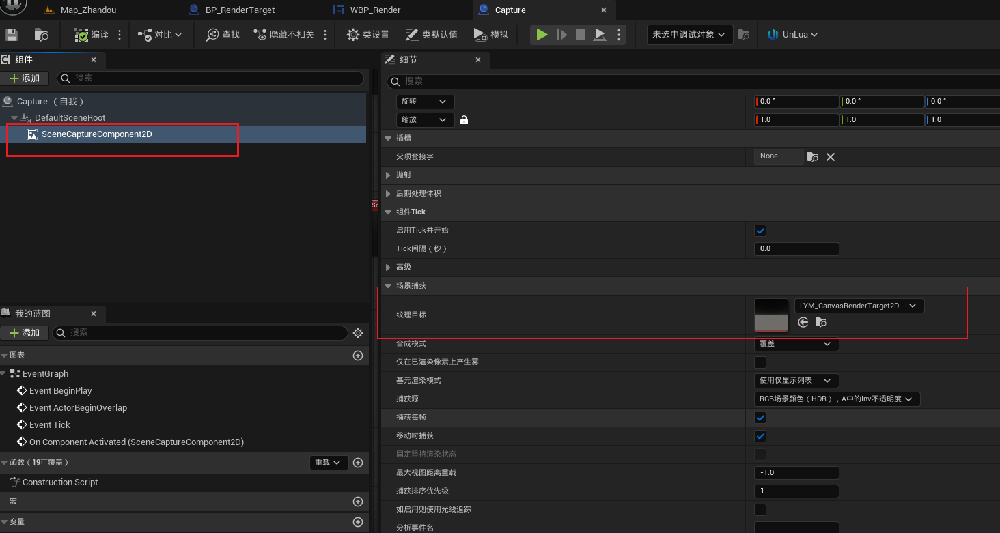

- SceneCaptureComponent2D 本质是摄像机组件，类似普通的CameraActor,能够实时拍摄它看到的场景内容。 
- 他捕获的内容会输出到RenderTarget （渲染目标纹理）上，这个纹理可以被UI的图像显示。
- UI绑定纹理的时候是实时绑定纹理资源的，所以摄像机更新的话--》纹理也会更新-->UI实时更新


RT是纹理目标，应该提前制作好，在使用的时候作为纹理传输进来到init函数中，

BP_RenderTarget应该是什么？应该其中有一个摄像机，然后再有一个Actor,摄像机拍摄Actor

在使用这个的时候就是将其他模型添加到actor上，然后在Ui上显示的时候就能够实时看到这个渲染的Actor了

如果是即用即创建的话，就在直接UI启动的时候创建吧，退出UI的时候删除。


材质是显示在UI上的时候使用的。、


CanvasRenderTarget2D是绑定在渲染摄像机上用的




| 项         | 内容                                                         |
| ---------- | ------------------------------------------------------------ |
| 蓝图路径   | 注意结尾要加 `_C` 表示类（不是对象），`BP_RenderTarget.BP_RenderTarget_C` |
| World 获取 | Widget 本身不能直接访问 World，通常通过 OwningPlayer 来获得  |
| 隐藏位置   | 可以 spawn 到不可见区域（如 Z=99999），或用 `SetActorHiddenInGame(true)` 隐藏 |
| 销毁逻辑   | Widget 销毁时调用 `RenderTargetActor:DestroyActor()`         |

| 问题              | 解决方式                                               |
| ----------------- | ------------------------------------------------------ |
| `GetWorld()` 报错 | 移动逻辑到 `Construct()` 中执行（Widget 创建完成之后） |


时常显示失败，因为有的时候Spawn是比较慢的，所以如果此时没有加载完成就init的话，会报错，怎么处理呢？


并不是，原因是spawn参数传错了，第二个应该是transform


为什么退出UI的时候并没有删除资源？

本来是同步或者异步的问题，搞一下午异步相关的东西，然后发现加载不出来渲染纹理，然后发现一个问题，从蓝图获取的2D纹理，纹理传参少了一层，之前报空，但是依然有时能够显示就没注意，修改之后，发现不用异步spawn就可以，直接spawnActor就可正常生成对象。

# 删除之后将变量设置为nil？为什么呢？

这是一个非常关键的问题，涉及到 **Lua的垃圾回收机制（GC）** 和 **Unreal对象生命周期管理** 的交集。我们来系统解释一下：

------

### ✅ 1. 为什么删除 `Actor` 后还要将变量设置为 `nil`？

#### 原因一：**Lua 变量本身还在引用该对象**

即使你调用了：

```lua
self.ModelActor:DestroyActor()
```

但是如果你没有写：

```lua
self.ModelActor = nil
```

那么 `self.ModelActor` 这个变量 **仍然在引用这个被标记为销毁的 UObject**，这会带来几个问题：

------

### ❌ 问题 1：阻止 GC 正常释放内存

UnLua 中的 `UObject` 是通过 `TSharedPtr` 管理的，只要 Lua 还有引用，它就认为你“还在用”，不会释放。

所以你必须告诉 Lua：

> “我不再用这个变量了” → `变量 = nil`

------

### ❌ 问题 2：你后续对这个变量访问会崩溃或报错

你可能在后面又写了：

```lua
self.ModelActor:K2_GetActorLocation()
```

如果这个 Actor 已经 Destroy 了，调用 `UObject` 方法会报错：

```
attempt to read invalid UObject ptr from lua
```

------

### ✅ 2. 设置为 `nil` 的作用总结：

| 操作                   | 作用                                  |
| ---------------------- | ------------------------------------- |
| `Actor:DestroyActor()` | 销毁引擎中的对象（Unreal）            |
| `self.Actor = nil`     | 清除 Lua 对该对象的引用，允许 GC 清理 |
| 双操作都要做           | 否则对象“物理销毁了，但逻辑引用还在”  |

------

### ✅ 3. 推荐的清理模式（通用写法）

```lua
function M:ClearActor(ActorVarName)
    local Actor = self[ActorVarName]
    if Actor and Actor:IsValid() then
        Actor:DestroyActor()
        self[ActorVarName] = nil
    end
end

-- 用法：
self:ClearActor("ModelActor")
self:ClearActor("RenderTargetCaptureActor")
```

------

### ✅ 4. 示例：关闭 UI 时清理资源

```lua
function M:OnClose()
    if self.ModelActor and self.ModelActor:IsValid() then
        self.ModelActor:DestroyActor()
        self.ModelActor = nil
    end
    
    if self.RenderTargetCaptureActor and self.RenderTargetCaptureActor:IsValid() then
        self.RenderTargetCaptureActor:DestroyActor()
        self.RenderTargetCaptureActor = nil
    end

    self:RemoveFromParent()
end
```

------

### ✅ 5. 补充说明：UnLua 特有的 GC 机制

UnLua 会通过一个弱引用表记录所有 Lua 层面持有的 `UObject`：

- **只有 Lua 层放弃引用（= nil）之后**，UnLua 才允许这个对象被销毁（如果它没有别的地方引用，比如 C++层）

------

### ✅ 总结一句话：

> **销毁 UE 对象时，设置 Lua 引用为 `nil` 是必须的，不然就像“尸体没埋，魂还缠着你”。**

------

如果你希望我写一个 UI 构造 + 异步生成 + 关闭时销毁并清理的标准模块代码，我可以给你一整套模板。要吗？


## 如何在其他lua表中导入相关的lua类并使用其中的函数？

前提： B是我们要调用的lua类，*其绑定了相关的蓝图类*  。当我们在A中进行调用的时候。

操作：在A中实例化蓝图，然后就能够通过这个实例化之后的对象对其中的函数进行使用。

```lua
---@type BP_A_C
lcaol M = Unlua.Class
function M:ReceiveBeginPlay()
   local World = self:GetWorld()
    ---
   local BPClass = UE.UClass.Load("Game/Blueprint/BP_B.BP_B_C")
    local Location = UE.FVector(0, 0, 0)
    local Rotation = UE.FRotator(0, 0, 0)
    
    local BActor = World:SpawnActor(BPBClass, Location, Rotation)
     --调用B.lua中的方法，首先验证是否生成成功，以及是否其中有这个函数，然后在进行调用，鲁棒性
    if BActor and BActor.TestFunc then 
        BActor:TestFunc()
    else
    	print("failed to call thefunc")
    end
    
end
renturn M
```


那如果调用的是非绑定蓝图的lua文件呢？

那就用标准的require

```lua
-- B.lua
local M = {}
function M.SayHello()
    print("Hello from pure Lua module!")
end
return M
```


A中调用B的函数的话：

```lua
-- A.lua
local B = require("B")

function M:ReceiveBeginPlay()
    B.SayHello()
end
```


| 用法类型              | 方式                         |
| --------------------- | ---------------------------- |
| 引用蓝图绑定的lua类时 | 实例化蓝图，并调用方法       |
| 引用纯Lua模块时       | 使用 local xx= require("xx") |


## 如何读懂log更好的提高开发效率？

如果我知道某个位置的断点执行了，说明上一步的代码是有问题的，我应该如何在编辑器中向前定位错误代码的位置？

