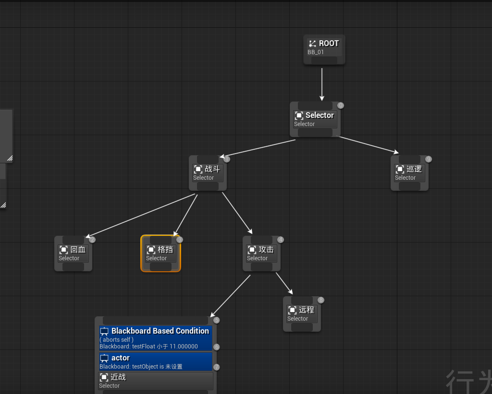
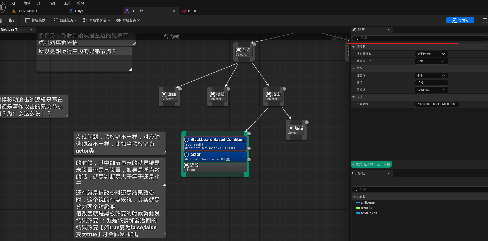
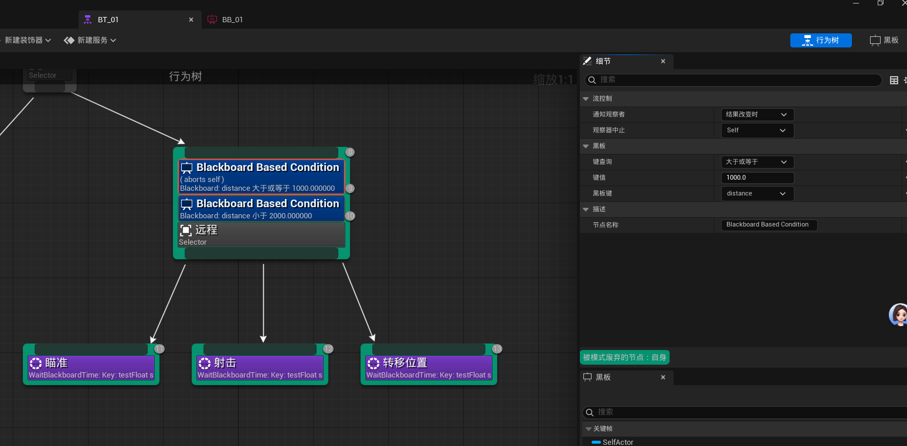

对反射数据使用meta可以控制其在编辑器的显示与否。而且可以通过A是否开启决定B,c,d是否开启的逻辑

例子：

```C++
	UPROPERTY(EditAnywhere, Category = KismetTraceSettings) // 显示在KismetTraceSettings分组
	bool bAreaHit = false;


	UPROPERTY(EditAnywhere, BlueprintReadWrite,Category = KismetTraceSettings, meta = (EditCondition = " bAreaHit == true ",EditConditionHides)) // 这里meta中设定了条件（某个变量作为条件），以及条件的作用（可编辑选项的显隐）
     bool TraceByChannelOrObjects = true;

//同理meta也能够多个条件的组合进行处理

	UPROPERTY(EditAnywhere, BlueprintReadWrite,Category = KismetTraceSettings ,meta = (EditCondition = " bAreaHit == true && TraceByChannelOrObjects == true" ，EditConditionHides))
       TEnumAsByte<ETraceTypeQuery>MyTraceChannel = UEngineType::ConvertToTraceType(ECC_GameTraceChannel4)
        //这是bAreaHit == true且TraceByChannelOrObjects == true的时候，还能够设置bAreaHit == true且TraceByChannelOrObjects == false的处理
    UPROPERTY(EditAnywhere, BlueprintReadWrite, Category = KismetTraceSettings, meta = (EditCondition = "bAreaHit == true && TraceByChannelOrObjects == false", EditConditionHides))
	TArray<TEnumAsByte<EObjectTypeQuery>> MyObjectTypesToHit = { UEngineTypes::ConvertToObjectType(ECC_WorldStatic), UEngineTypes::ConvertToObjectType(ECC_WorldDynamic) };

```


# 行为树扫盲


++  虚幻引擎中，selector节点的子节点是不是从左到右寻找到能够执行的子节点？亦或者说是，当从左到右第二节点在执行的时候，如果过程中不满足了，是不是向后执行下一个节点？

- 在虚幻引擎中，Selector 节点的子节点是从左到右执行的，会寻找能够成功执行的子节点。当从左到右第二个节点在执行时，如果执行过程中满足了成功条件，那么 Selector 节点会停止执行后续子节点，直接返回成功结果。
- 如果第二个节点执行失败，则会向后执行下一个节点，继续尝试，直到有子节点成功或所有子节点都失败为止。若所有子节点都失败，Selector 节点才会返回失败结果。


扫盲扫盲，终于扫到最盲的地方了

在启用打断Abort的时候，实际上是开启了对行为树黑板值的监听。

情景：一个Selector节点下的子节点从左到右为A B C

--待补充


### 打断自身的时候，上级的selector会有什么行为呢？

分情况讨论，如果绑定的黑板键abort self的Decorator是在A上，但是此时运行到B或者C节点了，此时黑板键变化，会执行打断操作码？

- 打断之后selector执行的操作是selector会重新开始从左到右重新评估。


如果绑定的黑板键abort self的Decorator是在A上，但是此时运行到B或者C节点了，此时黑板键变化，会执行打断操作吗？还是说不做任何事情了？还是说在开始abort self的时候在离开节点A的时候自动remove了监听？

结论：不会触发打断，也确实是在离开子节点A的时候移除了监听。

abort self 监听器的生命周期 ：当节点的decorator设置为Abort self 的时候，其会随着节点的启动开启生命周周期，在退出节点的时候结束其生命周期。

那如果是LowPriority的时候呢？ lowpriority的监听器的生命周期不会依赖于其所在的节点是否执行，并且Abort lower Priority生命周期是逻辑上全局的。其生命周期在被添加到行为树的时候开始，直到行为树结束或者被移除。

### ✅ 生命周期逻辑如下：

| 条件                                                   | 是否监听黑板变量变化     |
| ------------------------------------------------------ | ------------------------ |
| 节点还在行为树结构中                                   | ✅ 是的                   |
| 节点未被显式禁用/移除                                  | ✅ 是的                   |
| 节点未被执行（只是挂在树里）                           | ✅ 仍然监听               |
| 行为树运行中，节点 Decorator 为 `Abort Lower Priority` | ✅ 持续监听其绑定的黑板键 |
| 行为树停止运行                                         | ❌ 停止监听               |
| 节点被动态移除或行为树结构更改                         | ❌ 不再监听               |

问题：那打断自身之后，该节点向父节点返回什么呢？还是说什么，直接从最左边的兄弟节点开始重新评估呢？

对的，abort self之后，其父节点会在从左到右从新评估子节点。然后执行相关具体的任务。


## Abort both:

`Abort Both` = **"全局打断别人" + "在自己激活时监视是否要中断自己"**

Selector
├── A (Decorator: EnemyInSight == true, Abort: Both)
├── B
└── C
场景 1：当前执行 C，EnemyInSight 从 false → true

- A 的 Lower Priority 部分激活，打断当前正在执行的 C；
- 行为树重新评估，从左往右；
- A 条件满足，开始执行 A。

场景 2：当前执行 A，EnemyInSight 从 true → false

- A 的 Self 部分监听此变量；
- 变量变化后触发中断自身，A 中止；
- 行为树重新评估；
- A 条件现在不满足 → 执行 B 或 C。


## 生命周期可视对比（重点）

| 功能作用域                         | `Abort Self`  | `Abort Lower Priority` | `Abort Both`  |
| ---------------------------------- | ------------- | ---------------------- | ------------- |
| 监听是否打断自己                   | ✅（仅激活时） | ❌                      | ✅（仅激活时） |
| 监听是否打断低优先级他人           | ❌             | ✅（始终监听）          | ✅（始终监听） |
| 监听器何时绑定黑板                 | 节点激活时    | 加载树结构时           | 两者都有      |
| 黑板键变化能否触发行为树重新评估？ | 仅当自己激活  | 始终可以               | 始终可以      |


# 问题汇总：

根节点下一个selector节点，然后selector下面分为战斗和巡逻，战斗下面分为回血和攻击 攻击下面分为近战和远程。我现在有两个问题

1.如果是近战敌人肯定是移动到敌人身边用的比较多，所以移动应该写在哪里？

2.如果要加格挡，应该写在哪里？还是说如果近战和远战都能格挡的话写在战斗下面？层次设计方面有点迷惑

### 问题1：

将近战中的攻击包装成一个sequence， 

```pgsql
近战Sequence
├── MoveTo(TargetActor)（带装饰器：IsInAttackRange == false，Abort Self）
├── MeleeAttack（装饰器：IsInAttackRange == true）
```

在成功之后，直接abort 然后执行兄弟节点

### 问题2：

格挡行为应该挂在哪里？如果远程攻击能被格挡的话应该在更抽象的一层进行处理。比如只狼中的ai能够用刀格挡飞镖



注意个格挡行为要能够中断攻击和追击，所以要挂上Abort both


### 疑问3：

decorator本身就是作为评估器的存在是吧，所以一个selector节点有两个子节点A和B，当A上有decoratr并且abort self 的时候，decorator的条件是 一个浮点黑板键==11 。

那什么情况下会终止自身呢？有两个选项，值改变时和结果改变时，我该怎么选择呢？

首先明确前提：

评估器本质是条件判断器有以下功能

- 行为能不能够执行 【能不能进入该节点 ，**门卫**】
- 行为是否需要中止 【进入之后是不是需要持续监测黑板键，以及触发中断的条件 ，**随从**】
- 组合节点的分支是否能够进入或者维持

以问题例子分析，什么时候会中止自身。

在此情境下，因为我们关心的是是否为11，所以我们选两个都是一样的。

- 分析一下值改变和结果改变的区别：
  1. 值改变 其实就是黑板值每次改变都会触发通知。举例：黑板值从 10 → 11 → 12，会触发两次检查。
  2. 结果改变就是只有decorator评估结果从true-->false或者false变为true的时候才会触发检查，不会因为值变化而结果没变而反复触发
- 总结就是大多数情况下使用的就是结果改变的这个选项，比如血量是不是小于50%

### 问题4： 

那这个**结果改变时**和**值改变时**对**中止行为有影响吗**?是不是选择值改变时同时选择abort self 的时候其会在改变的时候就中止自身了还是说二者没有关联呢？



有影响！

这里举例说明：



这里我选择的时distance大于等于1000的时候在结果改变的时候中止自身，什么意思呢？

就是进入此分支树的时候，确实距离是在1000和2000之间，但是在下面节点运行的时候，此时不满足1000和2000之间这个条件，则会立即中止此行为树。

但如果选的时值改变时中止自身的话，就是一直打断，会出问题的。这就造成了不必要的中断了，因为我们关心的是条件 **是否从“满足 → 不满足”**，这时候选择 `值改变时` 会造成**不必要的中断**（即使值变了，结果其实没变）。

所以我的猜想是正确的，在此情景下，只要`Distance` 的黑板值发生改变，就会尝试中止自己（即便仍然符合 `>=1000` 的条件）。


### 问题5：

在一个节点上我加了装饰器float==11 我选择的是当结果改变时 观察器中止自身，当运行到这个节点的时候此时float确实等于11也就能够执行该节点任务，但是当黑板键改变的时候，可能变为10，13总之就是不等于11了，然后就会中止自身，但是值变的时候即使不中止自身这个节点也有会由于条件限制执行不了了呀，所以**这种情况下是不是加abort相当于冗余判断了**

你说：

> 黑板键都已经不满足条件了，就算没有 Abort，这个节点也执行不了了，所以加 Abort 是不是冗余？

------

##### 🧠 这里就有一个关键误区：

❌ “没有 Abort，也会停止执行” → **不对！**

> **行为树中的节点一旦开始执行，是不会自动停下来的**，除非你手动打断（Abort）或者任务自己返回失败。

关键点： **Decorator 条件只控制是否**“能不能进入执行”，**而不是**“执行过程中还能不能继续”

这就是为什么 **Abort Self** 是必须的：

- 没有它，条件变了，任务照样跑完；
- 有它，条件变了，**立刻打断**当前任务，跳出当前分支。

所以值改变时就中断自身的情况是存在的。因为在decorator判断是不是能够进入之后，如果我进去执行子树逻辑，但是在执行过程中如果黑板变化了，此时如果没有设置abort  self的话，其会继续完成下去，但是如果设计了abort self 那就会直接中断子树。

因为decorator不使用abort的话就意味着只是个看大门的，你进去之后黑板键变成什么样不管，但是使用了abort之后就相当于持续监控这个黑板键，不管是选择的self还是lowerpriority都是监控只是中断的位置不一样。

> 没有 Abort 的 Decorator 是一次性门卫，有 Abort 的 Decorator 是持续监听的安保系统。


### 问题6：

我还有个问题，就是终止的时候不管其父节点是selector还是sequence是不是都从其最左边的子节点重新进行评估?

是的，你理解得**完全正确**：

> **当行为树中的某个子节点因为 Abort 被中止时，无论它的父节点是 Selector 还是 Sequence，都会从该父节点的最左侧子节点重新评估！**

**并且即使是第一个节点被中止也会再次进行评估**

###### 🎯 举个例子

你有一个 `Selector` 结构：

```
css复制编辑Selector
├── A（正在运行）
├── B
└── C
```

现在 A 有一个 Decorator（监听 Distance），设置了 `Abort: Self` 或 `Both`。

当 `Distance` 改变 → Abort 触发 → A 被中止
 → Selector 会从最左侧重新评估，从 A 开始判断。

如果 A 的 Decorator 判断仍然为 True，A 还是会被选中；
 如果判断为 False，才会继续向右尝试 B、C。


# pawn的属性计算与传递


一般血量，体力，法力等都在pawn上，或者是pawn挂载的组件上。

那如何传递到黑板上是个大问题。

我们以下只讨论战斗状态能够获取到玩家的情况下：

首先明确我们通过AiPerception能够获取看到玩家的引用，然后能够将其设置为黑板键，这就意味着我们已经**拿到了玩家的引用**

所以在此基础上我们将在service中通过接口获取玩家的属性。以用来在后续处理近程或者远程攻击。

设置接口AttackAttributeInfo，返回值都是相关属性
